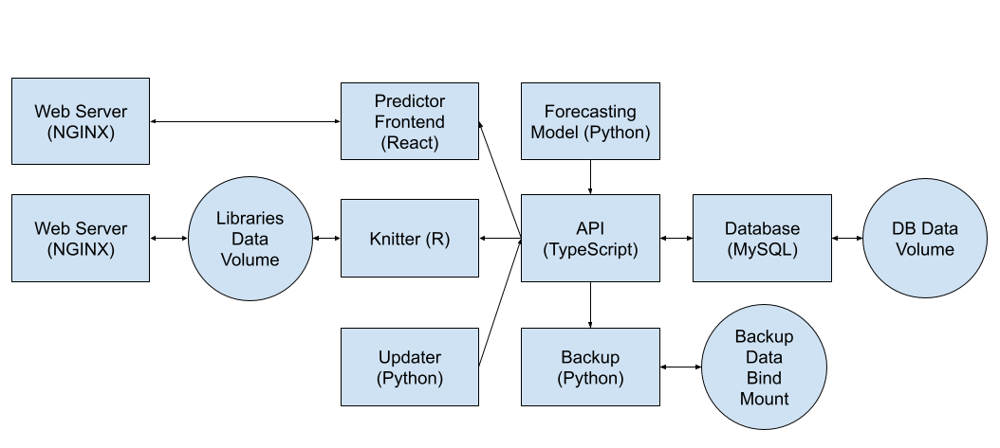

# Library Busyness

An application that stores data about the busyness of NCSU's libraries and compiles it into an html summary using rmarkdown.

# Design

## Architecture

## Containers

### `data/api`

A Node/TypeScript/Express API for interacting with the database. Includes routes for creating records and getting records--either all records, `n` recent records, or records since a given datetime.

### `data/db`

Handles the MySQL database. Contains one script other than the Dockerfile, `schema.sql`, that is run on container startup and creates tables if they do not exist.

### `data/backup`

When run, saves all recorded occupancy data to CSV files.

### `knitter`

Contains functionality for knitting the `rmarkdown` file into an html document. Note that in development, using `renv` is preferred; however, while using docker, `R` packages are installed using `apt` to speed up image build time.

### `server`

Handles an NGINX web server that serves the knitted `rmarkdown` html file.

### `updater`

Contains a python script that fetches current occupancy data and sends it to the TypeScript API.

### `predictor/model`

Contains a python script that trains a timeseries forecasting model on the busyness data, then sends some predictions back to the database

# Deployment with Docker

Required environment variables:
 - `MYSQL_ROOT_PASSWORD` - the password to set for the root user in the db container
 - `MYSQL_USER` - the user to use in the data logger when connecting to the database
 - `MYSQL_PASSWORD` - the password to use in the data logger when connecting to the database

Other environment variables and their defaults:
 - `MYSQL_DATABASE=busyness` - the name of the database to save records to
 - `MYSQL_HOST=db` - the database hostname
 - `API_HOST=api` - the hostname for the api server
 - `API_PORT=3000` - the port of the api server

Start nginx server: `docker compose up server -d`

Run updater and stop api and database afterward: `docker compose run --rm updater && docker compose down api && docker compose down db`

Run knitter and stop api and database afterward: `docker compose run --rm knitter && docker compose down api && docker compose down db`

Backup data to CSV files: `docker compose run --rm backup`. NOTE: ensure that the `export` folder is present in the `data/backup` folder.

Run model: `docker compose run --rm model`

Stop all services: `docker compose down`
